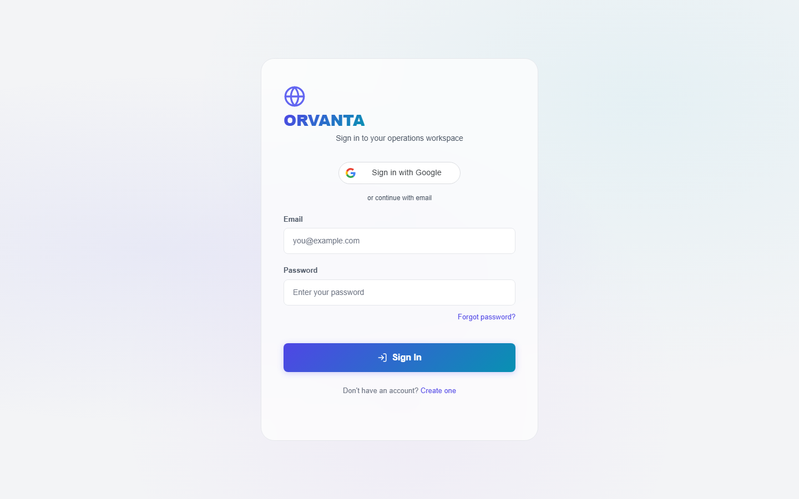
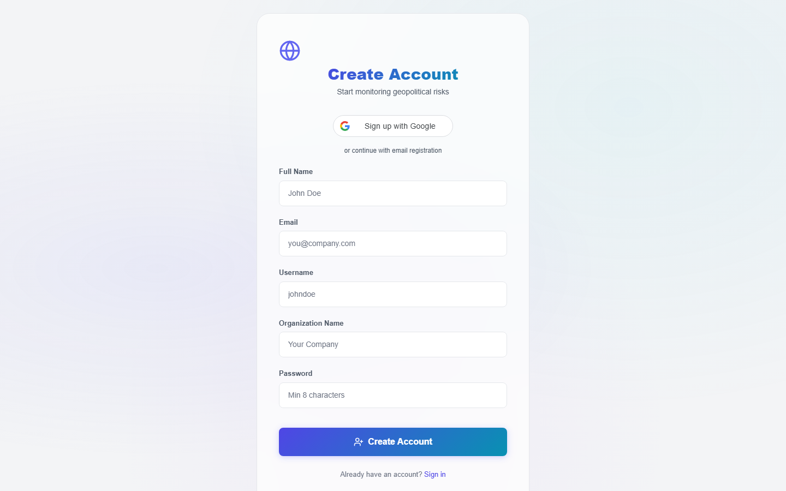
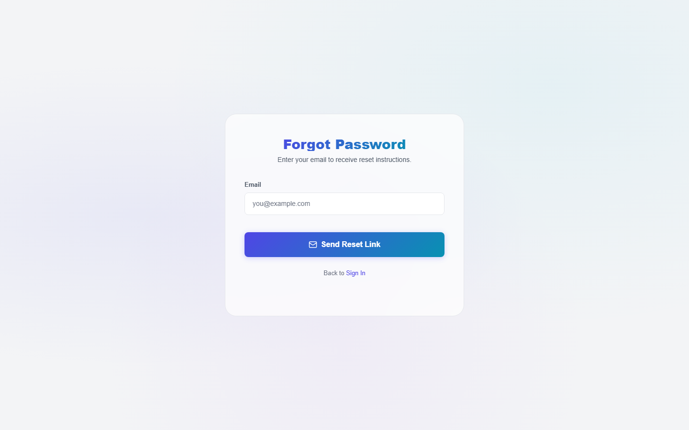
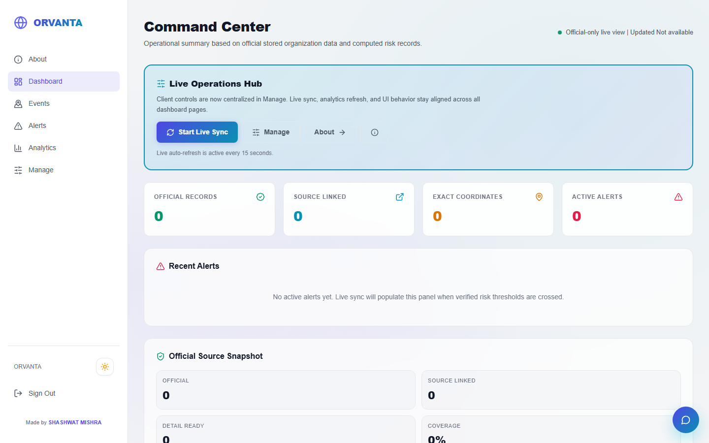
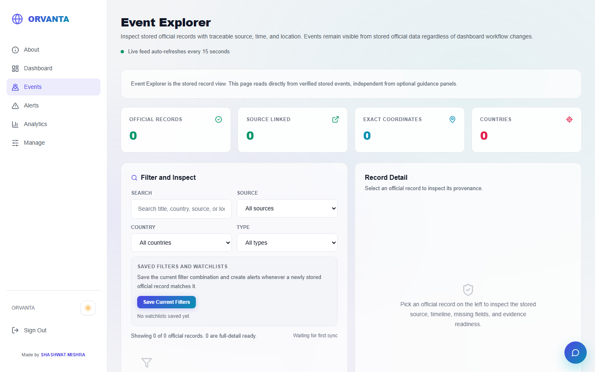
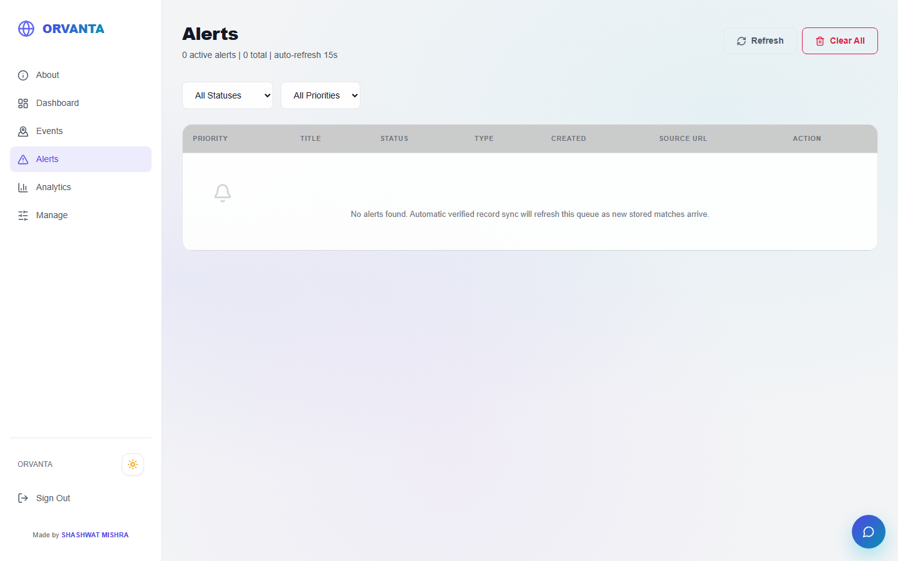
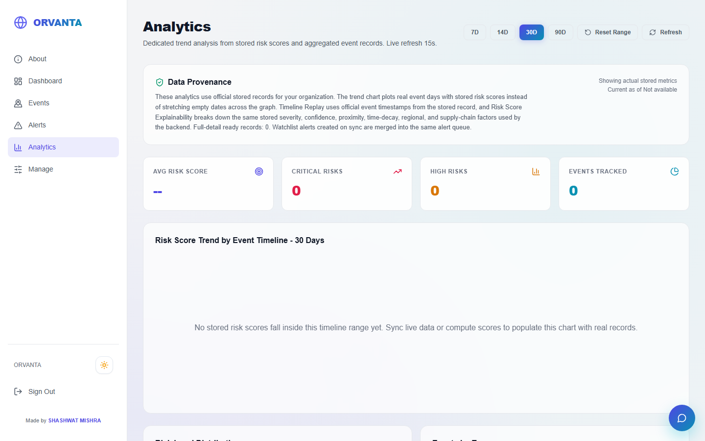
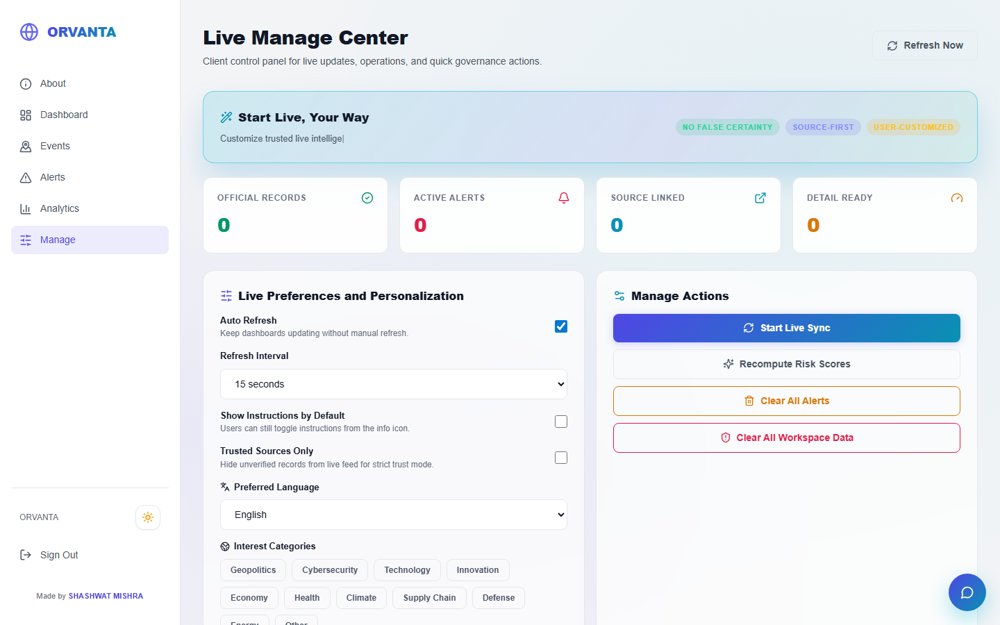
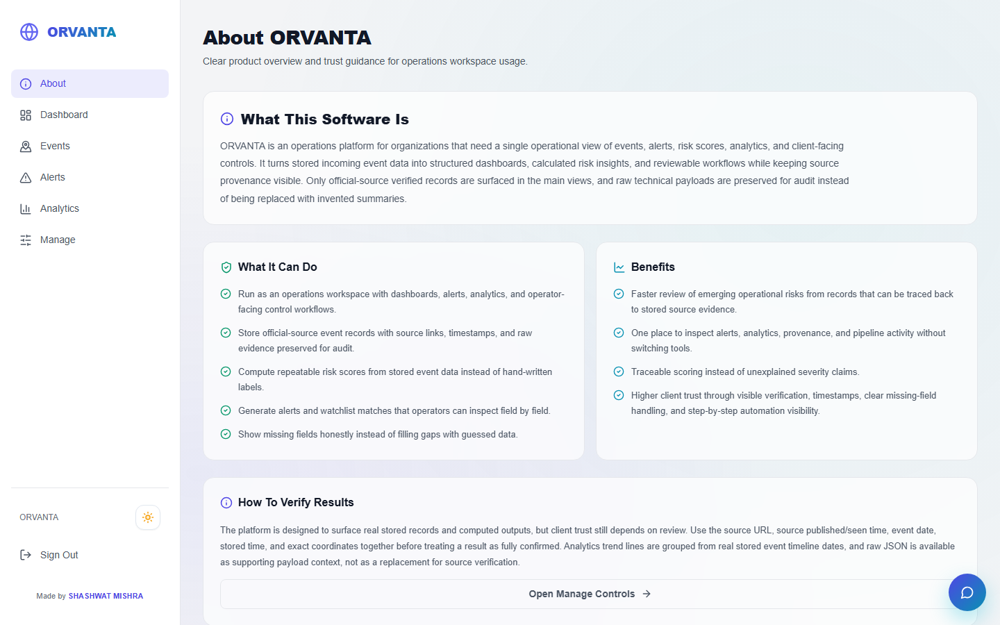
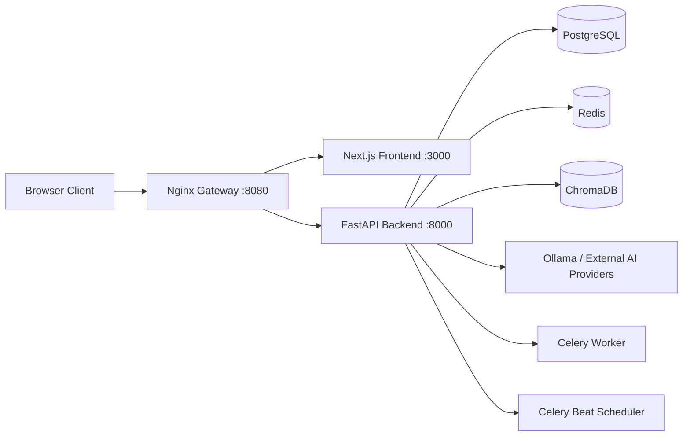

# ORVANTA AI

Operational Risk Visibility, Analysis, Notification, Triage, and Automation.

ORVANTA AI is a full-stack geopolitical risk intelligence platform for teams that need live monitoring, alerting, analytics, and operational response workflows in one place.

## Why ORVANTA AI

- Live risk monitoring from multiple feeds
- Clean dashboard for non-technical and technical users
- Alert pipeline with acknowledgment and resolution actions
- Analytics view for trends and replay windows
- Manage console for sync controls and workspace operations
- Built-in AI assistant for guided actions and context help

## Product Tour With Figures

All figures below are captured from the running app on browser routes.

### 1. Login



### 2. Register



### 3. Forgot Password



### 4. Dashboard Home



### 5. Events



### 6. Alerts



### 7. Analytics



### 8. Manage



### 9. About



## High-Level Architecture



## Tech Stack

- Frontend: Next.js 14, React, TypeScript, Framer Motion, Recharts
- Backend: FastAPI, SQLAlchemy Async, Pydantic
- Queue and jobs: Celery, Redis
- Data stores: PostgreSQL, ChromaDB
- Infra: Docker Compose, Nginx
- Auth options: App JWT, Google Sign-In, Supabase bridge

## Repository Structure

```text
backend/
  app/
    api/
    core/
    db/
    models/
    schemas/
    services/
    tasks/
frontend/
  src/
    app/
    components/
    lib/
nginx/
docker-compose.yml
README.md
```

## Local Setup Guide

### Prerequisites

- Docker Desktop
- Git
- Node.js 20+ (optional for non-docker local frontend work)
- Python 3.11+ (optional for non-docker backend work)

### 1) Clone Project

```bash
git clone https://github.com/SHASHWAT-MISHRA-997/ORVANTA-AI.git
cd ORVANTA-AI
```

### 2) Configure Environment

If `.env` does not exist, create it from `.env.example`.

Minimum important values to verify:

- `NEXT_PUBLIC_API_URL=http://localhost:8000/api/v1`
- `NEXT_PUBLIC_WS_URL=ws://localhost:8080/api/v1/ws`
- `NEXT_PUBLIC_SUPABASE_URL=...`
- `NEXT_PUBLIC_SUPABASE_PUBLISHABLE_KEY=...`
- `SUPABASE_URL=...`
- `SUPABASE_JWT_ISSUER=.../auth/v1`
- `SUPABASE_JWT_AUDIENCE=authenticated`

### 3) Start Full Stack

```bash
docker compose up -d --build
```

### 4) Open App

- Main app: http://localhost:8080
- Login: http://localhost:8080/login
- Mailpit (local SMTP inbox): http://localhost:8025

## First-Time User Flow

1. Open login page.
2. Sign in with Google or create account.
3. If you forget password, use Forgot Password.
4. After sign-in, open Dashboard, Events, Alerts, Analytics, and Manage.
5. Use Manage to run live sync and control workspace actions.

## Supabase Password Reset Setup

If you want real email delivery to Gmail/Outlook (not only Mailpit):

1. In Supabase Dashboard, set:
- Authentication -> URL Configuration
- Site URL: `http://localhost:8080`
- Redirect URL: `http://localhost:8080/reset-password`

2. In Supabase templates, enable and configure `Reset password` template.

3. For reliable delivery, configure custom SMTP inside Supabase:
- Authentication -> Email -> SMTP Settings
- Use a provider like Resend, SendGrid, or Gmail App Password

4. Keep these ORVANTA env values valid:
- `NEXT_PUBLIC_SUPABASE_URL`
- `NEXT_PUBLIC_SUPABASE_PUBLISHABLE_KEY`
- `SUPABASE_URL`
- `SUPABASE_JWT_ISSUER`
- `SUPABASE_JWT_AUDIENCE`

## API Quick Reference

- Health: `GET /api/v1/health`
- Login: `POST /api/v1/auth/login`
- Register: `POST /api/v1/auth/register`
- Forgot password: `POST /api/v1/auth/forgot-password`
- Supabase token exchange: `POST /api/v1/auth/supabase`
- Dashboard summary: `GET /api/v1/dashboard`
- Events: `GET /api/v1/events`
- Alerts: `GET /api/v1/alerts`

## Troubleshooting

### App opens but returns 502

- Restart gateway and frontend:

```bash
docker compose restart nginx frontend
```

- Check logs:

```bash
docker compose logs --tail=200 nginx
docker compose logs --tail=200 frontend
docker compose logs --tail=200 backend
```

### Forgot password goes to Mailpit only

- Frontend must receive Supabase env vars
- Supabase template and URL config must be set
- If delivery is still missing, configure custom SMTP in Supabase

### Frontend container exits after package update

Run:

```bash
docker compose up -d --build frontend
```

Then inspect:

```bash
docker compose logs --tail=200 frontend
```

## Development Commands

```bash
# Start everything
docker compose up -d --build

# Stop everything
docker compose down

# Rebuild a single service
docker compose up -d --build frontend

# View running services
docker compose ps
```

## Security Notes

- Never commit real secrets in `.env`
- Keep API keys rotated periodically
- Use production-grade SMTP for public deployment
- Restrict CORS and hostnames for production

## License

Use your preferred license for this repository. If not yet added, create a `LICENSE` file before production distribution.

## Maintainer

SHASHWAT MISHRA
